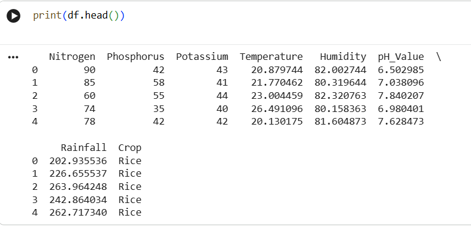

# Agricultural Yield Optimizer 🌱

##  Project Overview
The Agricultural Yield Optimizer is a machine learning project that predicts crop yield based on soil nutrients and environmental conditions such as Nitrogen, Phosphorous, Potassium, and Rainfall.  

The goal of this project is to help farmers estimate crop production and make better agricultural decisions using data-driven insights.

---

## Features
- Data preprocessing and cleaning
- Feature scaling
- Training machine learning models
- Random Forest model for crop yield prediction
- Visualizing feature importance
- Predicting crop yield for given soil and weather conditions
---

##  Technologies Used
- Python
- Pandas
- NumPy
- Scikit-learn
- Matplotlib
- Jupyter Notebook

---

##  Dataset
The dataset contains agricultural data including:

- Nitrogen
- Phosphorous
- Potassium
- Rainfall
- Crop Yield

---

## Installation

Installation / How to Run

Make it step-by-step for GitHub users:

1. Clone the repository:

git clone https://github.com/PallaviBadiger/Agricultural-Yield-Optimizer.git

2. Install dependencies:

pip install -r requirements.txt

3. Open the notebook in Google Colab or Jupyter Notebook:

Agricultural_Yield_Optimizer.ipynb

4. Run all cells to train the model and make predictions.
   
---

### **8️⃣ Screenshots / Demo**
- Add a **few images of your outputs** from Colab (you already uploaded them). Example:
```markdown
## Screenshots


9️⃣ Future Work / Improvements (Optional)
## Future Work
- Deploy a Streamlit web app for user-friendly crop prediction
- Include more environmental features like Temperature and Humidity
- Compare different machine learning models for accuracy
